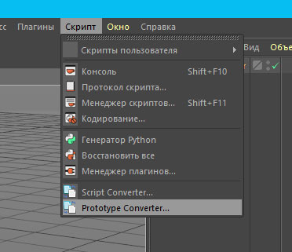
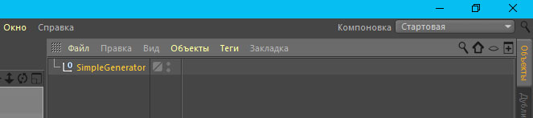
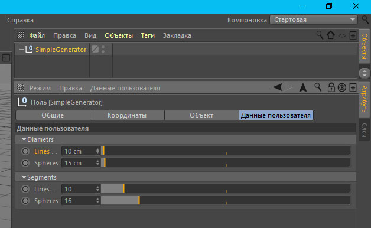
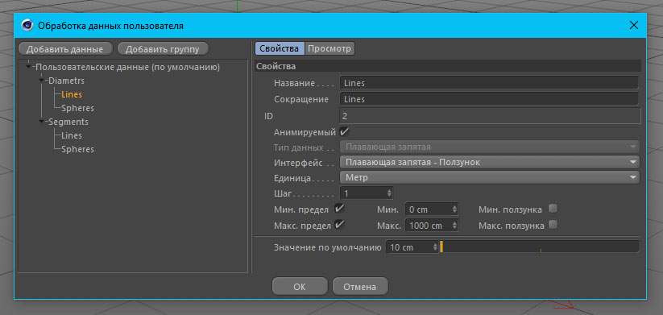
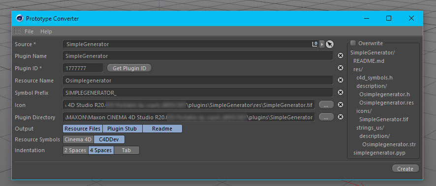
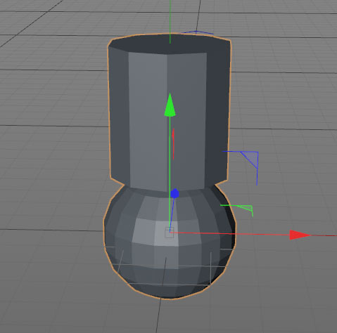

## Пишем первый плагин
### Напишем ObjectData плагин
ObjectData плагин создает на сцене объект. Это может быть `c4d.PolygonObject` или `c4d.SplineObject`.
Так же ObjectData плагин может создавать модификатор, например полигонов или системы частиц.
В официальном репозитории от Maxon - есть примеры плагинов: [Py-RoundedTube][2], [Py-DoubleCircle][3], [Py-SpherifyModifier][4] и [Py-Gravitation][5]

Итак, первым делом создадим в папке `plugins` директорию с названием своего плагина - пусть это будет `SimpleGenerator`. Папка `plugins` находится примерно по такому пути
`C:\Users\UserName\AppData\Roaming\MAXON\Maxon CINEMA 4D Studio R20.030\plugins`. Имя пользователя `UserName` и версию CINEMA в пути - меняете на свои. В папке `SimpleGenerator`
создаем папку `res`, в которую положим файл иконки нашего плагина. Обычно это файл формата `.tif` размером 32х32 пикселя.

Дальше, нам нужно создать каталоги и ресурсные файлы плагина. В нашем случае это должно выглядеть так:
```
SimpleGenerator/
    simplegenerator.pyp

    res/
        c4d_symbols.h
        description/
            Osimplegenerator.h
            Osimplegenerator.res

        strings_en-US/
            c4d_strings.str
            description/
                Osimplegenerator.str

        SimpleGenerator.tif
```
Можно создать все ресурсные файлы вручную в текстовом редакторе. О том как это сделать можно посмотреть, например [здесь][1].

А можно воспользоваться утилитой написанной `nrosenstein` - "Cinema 4D Prototype Converter". Подробнее, как установить и использовать - [смотреть тут][6]

Правда, для ее использования понадобится Cinema 4D версии R20. Скачиваем пакет, создаем в папке `plugins` папку `converter` и распаковываем в нее содержимое пакета. Запускаем Cinema 4D R20 и проверяем тут в меню > Скрипт:
***


Теперь создаем Null-объект и назовем его `SimpleGenerator`:
***


Если мы хотим, чтобы у созданного объекта можно было менять параметры (в том числе анимировать их) - нам нужно добавить их через опцию "Данные пользователя">"Добавить данные пользователя...". Мы создадим эти данные на нашем Null-объекте:
***



Сделаем две группы "Diametrs" и "Segments". В каждой группе добавим по 2 поля для данных "Lines" и "Spheres". В первой группе поля будут иметь вещественный тип, а во второй - целый. Выделяем наш Null-объект и запускаем Prototype Converter:
***


Заполняем поля Prototype Converter:
 - `Sourse` - здесь указываем с какого объекта считывать пользовательские данные (в нашем случае - null-object SimpleGenerator)
 - `Plugin Name` - название нашего плагина
 - `Plugin ID` - уникальный ID нашего плагина
 - `Resource Name` - имя файла ресурсов для нашего плагина
 - `Symbol Prefix` - префикс для переменных в коде нашего плагина
 - `Icon` - путь до иконки.
 - `Plugin Directory` - указываем путь к папке плагина

Больше ничего менять не нужно. На моем скрине я ввел все данные соответсвенно своим настройкам. Жмем кнопочку `Create` и переходим к папке своего плагина. В ней находим файл `simplegenerator.pyp` и открываем его в редакторе:
```python
# Copyright (C) <year> <author>

# TODO: Remove redundant imports
# TODO: Update Copyright information
# TODO: Add a README file
# TODO: Keep in mind that the variables `doc` and `op` are no longer globally available

import c4d
import os


#
# Note: Check out the C4DDev project which contains tools that can parse
# resource files and generate Python code with all the symbols, similar to
# what you can see below.
#
#   See https://github.com/NiklasRosenstein/c4ddev
class res(object):
    SIMPLEGENERATOR_DIAMETRS_GROUP = 1000
    SIMPLEGENERATOR_DIAMETRS_LINES = 1001
    SIMPLEGENERATOR_DIAMETRS_SPHERES = 1002
    SIMPLEGENERATOR_SEGMENTS_GROUP = 1003
    SIMPLEGENERATOR_SEGMENTS_LINES = 1004
    SIMPLEGENERATOR_SEGMENTS_SPHERES = 1005
res = res()


def load_bitmap(path):
    path = os.path.join(os.path.dirname(__file__), path)
    bmp = c4d.bitmaps.BaseBitmap()
    if bmp.InitWith(path)[0] != c4d.IMAGERESULT_OK:
        bmp = None
    return bmp


class SimpleGeneratorData(c4d.plugins.ObjectData):

    PLUGIN_ID = 1777777
    PLUGIN_NAME = 'SimpleGenerator'
    PLUGIN_INFO = 0
    PLUGIN_DESC = 'Osimplegenerator'
    PLUGIN_ICON = load_bitmap('res/icons/SimpleGenerator.tif')
    PLUGIN_DISKLEVEL = 0

    @classmethod
    def Register(cls):
        return c4d.plugins.RegisterObjectPlugin(
            cls.PLUGIN_ID, cls.PLUGIN_NAME, cls, cls.PLUGIN_DESC, cls.PLUGIN_INFO,
            cls.PLUGIN_ICON, cls.PLUGIN_DISKLEVEL)

    def Init(self, node):
        self.InitAttr(node, float, [res.SIMPLEGENERATOR_DIAMETRS_LINES])
        self.InitAttr(node, float, [res.SIMPLEGENERATOR_DIAMETRS_SPHERES])
        self.InitAttr(node, int, [res.SIMPLEGENERATOR_SEGMENTS_LINES])
        self.InitAttr(node, int, [res.SIMPLEGENERATOR_SEGMENTS_SPHERES])

        node[res.SIMPLEGENERATOR_DIAMETRS_LINES] = 14.0
        node[res.SIMPLEGENERATOR_DIAMETRS_SPHERES] = 16.0
        node[res.SIMPLEGENERATOR_SEGMENTS_LINES] = 10
        node[res.SIMPLEGENERATOR_SEGMENTS_SPHERES] = 18
        return True

if __name__ == '__main__':
    SimpleGeneratorData.Register()
```
Это уже рабочий плагин. Он загружается и запускается без ошибок. Но пока ничего не создает. Чтобы это исправить изменяем в этой строке 0 на `c4d.OBJECT_GENERATOR`:
```python
PLUGIN_INFO = c4d.OBJECT_GENERATOR
```
осталось добавить метод, который будет создавать и возвращать объект:
```python
    def GetVirtualObjects(self, op, hh):

        sphere = c4d.BaseObject(c4d.Osphere)
        sphere[c4d.PRIM_SPHERE_RAD] = 55
        sphere[c4d.PRIM_SPHERE_SUB] = 12
        sphere[c4d.PRIM_SPHERE_PERFECT] = True

        return sphere
```
и конечно это:
```python
    def __init__ (self):
        self.SetOptimizeCache(True)
```
Разумеется, оба метода должны принадлежать классу `SimpleGeneratorData`, который является основным для нашего плагина и наследуется от `c4d.plugins.ObjectData`.
Вот теперь наш плагин при запуске создает на сцене сферу! Правда, у сферы все параметры фиксированы, а созданные нами никак не влияют на неё... Сейчас мы это исправим!
```python
    def GetVirtualObjects(self, op, hh):

        sphere = c4d.BaseObject(c4d.Osphere)
        sphere[c4d.PRIM_SPHERE_RAD] = op[c4d.SIMPLEGENERATOR_DIAMETRS_SPHERES]
        sphere[c4d.PRIM_SPHERE_SUB] = op[c4d.SIMPLEGENERATOR_SEGMENTS_SPHERES]
        sphere[c4d.PRIM_SPHERE_PERFECT] = True

        return sphere
```
Изменение полей `Spheres` приводит к изменениям диаметра сферы и количества её сегментов! Но на этом еще не всё. Мы ведь зачем-то создали и параметры `Lines`, значит мы хотели создать по крайней мере два объекта. Но метод `GetVirtualObjects` всегда должен возвращать только один объект! Тут мы можем либо создать Null-объект, подчинить ему все остальные объекты и вернуть этот Null. Либо сделать один из имеющихся объектов корневым и остальные подчинить ему в нужной иерархии (и вернуть корневой объект). Мы поступим первым способом:
```python
    def GetVirtualObjects(self, op, hh):

        null = c4d.BaseObject(c4d.Onull)

        linispline = c4d.SplineObject(2, c4d.SPLINETYPE_LINEAR)

        # Создаем первую точку сплайна
        point = c4d.Vector(0., 0., 0.)
        # Добавляем точку в сплайн
        linispline.SetPoint(0, point)

        # Создаем вторую точку сплайна
        point2 = c4d.Vector(0., 30., 0.)
        # Добавляем точку в сплайн
        linispline.SetPoint(1, point2)

        # Создаем круглый сплайн
        circle = c4d.BaseObject(c4d.Osplinenside)
        circle[c4d.PRIM_NSIDE_RADIUS] = op[c4d.SIMPLEGENERATOR_DIAMETRS_LINES]
        circle[c4d.PRIM_NSIDE_SIDES] = op[c4d.SIMPLEGENERATOR_SEGMENTS_LINES]
        # Создание объекта Osweep
        sweep = c4d.BaseObject(c4d.Osweep)
        sweep[c4d.ID_BASEOBJECT_REL_POSITION,c4d.VECTOR_Y] = op[c4d.SIMPLEGENERATOR_DIAMETRS_SPHERES] - 1
        linispline.InsertUnder(sweep)
        circle.InsertUnder(sweep)
        circle.Message(c4d.MSG_UPDATE)

        sphere = c4d.BaseObject(c4d.Osphere)
        sphere[c4d.PRIM_SPHERE_RAD] = op[c4d.SIMPLEGENERATOR_DIAMETRS_SPHERES]
        sphere[c4d.PRIM_SPHERE_SUB] = op[c4d.SIMPLEGENERATOR_SEGMENTS_SPHERES]
        sphere[c4d.PRIM_SPHERE_PERFECT] = True

        sphere.InsertUnder(null)
        sweep.InsertUnder(null)
        return null
```
Конечно, можно было использовать примитив-объект `Cylinder` вместо того чтобы создавать сплайн и свип к нему. А можно было построить объект из отдельных полигонов и еще кучей способов на которые хватит вашей фантазии!

В итоге мы получили такой объект, созданный нашим плагином:
***


Теперь, вы можете создавать и свои объекты, назначать им параметры и свою логику. Сконвертируйте полученный объект в полигональный клавишей `C` - вы увидите что он состоит из тех объектов, которые мы создавали в методе `GetVirtualObjects`


[1]: https://safina3d.blogspot.com/2019/10/torus-knot.html "tutorial"
[2]: https://github.com/PluginCafe/cinema4d_py_sdk_extended/tree/master/plugins/py-rounded_tube_r13/py-rounded_tube_r13.pyp "Py-RoundedTube"
[3]: https://github.com/PluginCafe/cinema4d_py_sdk_extended/tree/master/plugins/py-double_circle_r19/py-double_circle_r19.pyp "Py-DoubleCircle"
[4]: https://github.com/PluginCafe/cinema4d_py_sdk_extended/tree/master/plugins/py-spherify_modifier_r13/py-spherify_modifier_r13.pyp "Py-SpherifyModifier"
[5]: https://github.com/PluginCafe/cinema4d_py_sdk_extended/tree/master/plugins/py-gravitation_r12/py-gravitation_r12.pyp "Py-Gravitation"
[6]: https://github.com/nrosenstein-c4d/c4d-prototype-converter?tab=readme-ov-file "Prototype Converter"