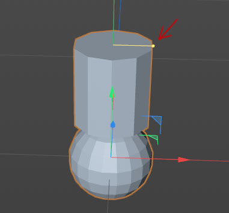

## Улучшаем плагин - добавляем визуальный элемент управления

В созданный нами, ObjectData-плагин можно добавить улучшение в виде визуального манипулятора во вьюпорте:
***


С помощью этого маркера можно будет изменять диаметр цилиндра прямо на сцене. Чтобы сделать это - нам потребуется дописать для класса `SimpleGeneratorData` 4 метода и одно свойство. Приступим:
```python
class SimpleGeneratorData(c4d.plugins.ObjectData):
    # ... остальной код
    HANDLECOUNT = 1
    def GetHandleCount(self, op):
        return self.HANDLECOUNT
```
Мы добавили свойство указывающее сколько хендлеров у нас будет (в нашем случае для простоты - 1) и метод возвращающий количество хендлеров.

Следующий метод - по индексу хендлера, заполняет информацию о типе (в нашем случае линейный), расположении в пространстве и направлении в котором можно смещать ручку:
```python
class SimpleGeneratorData(c4d.plugins.ObjectData):
    # ... остальной код
    def GetHandle(self, op, i, info):
        rr = op[c4d.SIMPLEGENERATOR_DIAMETRS_LINES]
        hh = op[c4d.SIMPLEGENERATOR_DIAMETRS_SPHERES] + 30.0
        if i == 0:
            info.position = c4d.Vector(rr, hh, 0.0)
            info.direction = c4d.Vector(1.0, 0.0, 0.0)
            info.type = c4d.HANDLECONSTRAINTTYPE_LINEAR
```

Третий необходимый нам метод определяет как должны измениться параметры нашего объекта при смещении хендлера с индексом i в координату p:
```python
class SimpleGeneratorData(c4d.plugins.ObjectData):
    # ... остальной код
    def SetHandle(self, op, i, p, info):
        # создаем HandleInfo
        tmp = c4d.HandleInfo()

        # заполняем текущими данными
        self.GetHandle(op, i, tmp)

        # получаем значение приращения
        val = (p-tmp.position) * info.direction

        # меняем нужный параметр
        if i == 0:
            op[c4d.SIMPLEGENERATOR_DIAMETRS_LINES] = c4d.utils.FCut(op[c4d.SIMPLEGENERATOR_DIAMETRS_LINES]+val, 0, 1000)
            # метод c4d.utils.FCut ограничивает значения между 0 и 1000
```

Остался последний метод Draw, который будет рисовать наш хендлер и обновлять его при любом изменении:
```python
class SimpleGeneratorData(c4d.plugins.ObjectData):
    # ... остальной код
    def Draw(self, op, drawpass, bd, bh):
        # Если текущий проход отрисовки не является дескриптором, пропустите этот вызов отрисовки
        if drawpass != c4d.DRAWPASS_HANDLES:
            return c4d.DRAWRESULT_SKIP
        # Определяем матрицу рисования для матрицы объекта
        m = bh.GetMg()
        bd.SetMatrix_Matrix(op, m)
        # Проверяем, наведен ли в данный момент мышью на один из дескрипторов текущего объекта.
        hitId = op.GetHighlightHandle(bd)

        hh = op[c4d.SIMPLEGENERATOR_DIAMETRS_SPHERES] + 30.0
        # Перебираем хендлеры и рисуем их
        for i in range(self.HANDLECOUNT):
            # Определяем цвет маркера в зависимости от состояния объекта при наведении
            handleColorFlag = c4d.VIEWCOLOR_HANDLES if c4d.GetC4DVersion() >= 21000 else c4d.VIEWCOLOR_ACTIVEPOINT
            hoverColor = c4d.VIEWCOLOR_SELECTION_PREVIEW if hitId == i else handleColorFlag
            bd.SetPen(c4d.GetViewColor(hoverColor))

            # Получаем информацию о текущем дескрипторе
            info = c4d.HandleInfo()
            self.GetHandle(op, i, info)

            # Приводим ручку в правильное положение
            bd.DrawHandle(info.position, c4d.DRAWHANDLE_BIG, 0)

            # Возвращаем цвет к нормальному состоянию перед рисованием линий
            bd.SetPen(c4d.GetViewColor(handleColorFlag))

            # Рисуем линию
            if i == 0:
                bd.DrawLine(info.position, c4d.Vector(0.0, hh, 0.0), 0)

        return c4d.DRAWRESULT_OK
```

Сверяемся с документацией:
 - [c4d.BaseDraw][1]
 - [c4d.plugins.ObjectData][2]
 - [Py-RoundedTube][3]

[1]: https://developers.maxon.net/docs/py/23_110/modules/c4d/C4DAtom/GeListNode/BaseList2D/BaseView/BaseDraw/index.html
[2]: https://developers.maxon.net/docs/py/23_110/modules/c4d.plugins/BaseData/NodeData/ObjectData/index.html
[3]: https://github.com/PluginCafe/cinema4d_py_sdk_extended/tree/master/plugins/py-rounded_tube_r13/py-rounded_tube_r13.pyp
