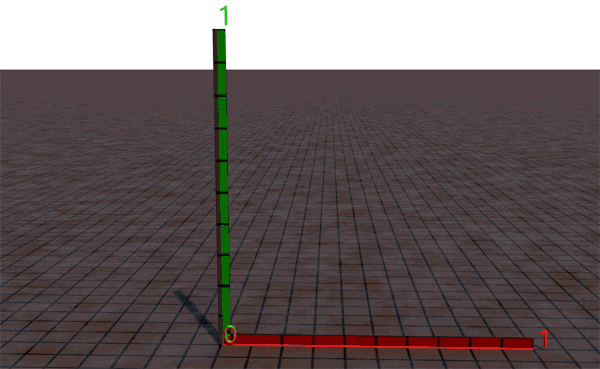

# Матрицы в Cinema 4D

[Матрица][1] — это тип для представления [линейных преобразований][3] в Cinema 4D. Матрица состоит из четырех компонентов:
 - v1 — ось X или базисный вектор i кадра линейного преобразования, определенного экземпляром Matrix.
 - v2 — ось Y или базисный вектор j кадра линейного преобразования, определенного экземпляром Matrix.
 - v3 — ось z или базисный вектор k кадра линейного преобразования, определенного экземпляром Matrix.
 - off — дополнительный компонент перемещения.

Матрицу можно создать несколькими способами, поскольку все аргументы ее конструктора необязательны:
```python
# Matrix(v1: (1, 0, 0); v2: (0, 1, 0); v3: (0, 0, 1); off: (0, 0, 0))
defaultMatrix = c4d.Matrix() # без параметров создаст дефолтную матрицу

# создаст стандартну матрицу повернутую на 90 градусов против часовой стрелки по оси Z
m = c4d.Matrix(v1=c4d.Vector( 0, 1, 0),
               v2=c4d.Vector(-1, 0, 0),
               v3=c4d.Vector( 0, 0, 1))
```
Матрицы достаточно, чтобы хранить все три важных свойства объекта: положение, вращение и масштаб. (Положение хранится в первом векторе, вращение определяется направлением трех осевых векторов, а масштаб определяется их длиной.) Поэтому каждый объект имеет матрицу, которую вы можете получить с помощью BaseObject.GetMl().

Чтобы понять как набор из трех векторов (v1, v2, v3) определяет вращение и масштаб объектов сцены - нужно представить что к каждому объекту прикреплены три единичных вектора (взаимно перпендикулярных). Каждый из этих векторов имеет проекцию на оси X,Y и Z, поэтому имеем набор из 3x3 = 9 чисел. Изначально, каждый из трех векторов параллелен одной из осей и имеет максимальное значение проекции на эту ось равное 1, и две проекции на другие оси со значениями 0. Имеем:
```
_____ X__Y__Z
X v1: 1, 0, 0
Y v2: 0, 1, 0
Z v3: 0, 0, 1
```
Если мы начнем вращать объект вокруг оси Z то увидим как меняются проекции векторов v1 и v2 на оси X и Y
***


После поворота, на последнем кадре будет:
```
_________ X_____Y____Z
X v1:  0.759, 0.652, 0
Y v2: -0.652, 0.759, 0
Z v3:  0,     0,     1
```
Чтобы сравнить два объекта в разных иерархиях, нам нужен способ получить их глобальные координаты. Здесь на помощь приходит умножение матриц. Умножение двух матриц — это не просто умножение соответствующих чисел; это гораздо сложнее. Фактически, умножение матриц даже не коммутативно: a\*b — это не то же самое, что b\*a . К счастью, для этого не обязательно знать, как умножать две матрицы.

Если матрица Mp является матрицей родительского элемента, а Mc — матрицей дочернего элемента, то произведение Mp*Mc дает матрицу, которая представляет положение и вращение дочернего элемента, но в системе координат родительского элемента. Это означает, что получение глобальной матрицы дочернего элемента — это всего лишь вопрос умножения ее на каждую из матриц его родителей.

К счастью, нам не придется делать это умножение самостоятельно. Каждый объект имеет следующие предопределенные функции:
```python
GetMl()      # Возвращает матрицу в локальных координатах
GetMg()      # Возвращает матрицу в глобальных координатах
GetUpMg()    # Возвращает родительскую матрицу в глобальных координатах
```
Например, если у вас есть объект с именем «MyObject», спрятанный глубоко в иерархии объектов, следующий код напечатает его глобальную позицию:
```python
obj = doc.SearchObject("MyObject")
mat = obj.GetMg()        # глобальная матрица
globalPos = mat.off      # получаем позицию из матрицы
print ("Global pos= ", globalPos)
```
Чтобы вычислить расстояние между двумя объектами в разных иерархиях, просто используйте их глобальные позиции:
```python
p1 = op1.GetMg().off
p2 = op2.GetMg().off
dist = (p2-p1).GetLength()
```


[1]: https://developers.maxon.net/docs/py/23_110/manuals/data_algorithms/classic_api/matrix.html

[2]: https://developers.maxon.net/docs/py/23_110/modules/c4d.utils/index.html#c4d.utils.HPBToMatrix

[3]: https://ru.wikipedia.org/wiki/%D0%9B%D0%B8%D0%BD%D0%B5%D0%B9%D0%BD%D0%BE%D0%B5_%D0%BE%D1%82%D0%BE%D0%B1%D1%80%D0%B0%D0%B6%D0%B5%D0%BD%D0%B8%D0%B5 "Линейное отображение"

[4]: https://ru.wikipedia.org/wiki/%D0%95%D0%B4%D0%B8%D0%BD%D0%B8%D1%87%D0%BD%D0%B0%D1%8F_%D0%BC%D0%B0%D1%82%D1%80%D0%B8%D1%86%D0%B0 "Единичная матрица"
