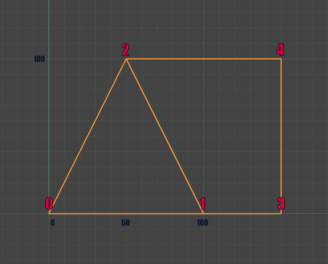

## Как создать [полигон][1]

Создаем новый полигон с тремя точками

```Python
    polygon = c4d.PolygonObject(3, 1) # 3 точки 1 полигон
```

Устанавливаем координаты точек полигона

```Python
    points = polygon.GetAllPoints()
    points[0] = c4d.Vector(0, 0, 0)
    points[1] = c4d.Vector(20, 0, 0)
    points[2] = c4d.Vector(0, 25, 0)
    polygon.SetAllPoints(points)
```

Далее указываем, какие точки надо соединить.
От последовательности зависит куда направлена нормаль.

```Python
    poly = c4d.CPolygon(0, 1, 2)
    polygon.SetPolygon(0, poly) # полигон один, и его индекс = 0
```

обновить
```Python
  polygon.Message(c4d.MSG_UPDATE)
```
Вот более сложный пример, в котором создадим меш из двух полигонов треугольного и примыкающего к нему четырехугольного.
Вот полный код:
```Python
import c4d
from c4d import Vector

def main():
    # Создаем новый полигональный объект с 5 вершинами и 2 полигонами
    poly_object = c4d.PolygonObject(5, 2)
    
    # Задаем вершины для треугольника и квадрата
    poly_object.SetPoint(0, Vector(0, 0, 0))    # вершина в начале координат
    poly_object.SetPoint(1, Vector(100, 0, 0))  # Общая точка
    poly_object.SetPoint(2, Vector(50, 100, 0)) # Вершина треугольника (Общая точка)
    poly_object.SetPoint(3, Vector(150, 0, 0))  # Вершина четырехугольника
    poly_object.SetPoint(4, Vector(150, 100, 0))# Вершина четырехугольника

    # Создаем полигоны
    # Треугольник - первый полигон
    poly_object.SetPolygon(0, c4d.CPolygon(0, 1, 2))
    # Квадрат - второй полигон (две стороны квадрата общие с треугольником)
    poly_object.SetPolygon(1, c4d.CPolygon(1, 3, 4, 2))

    # Вызываем, чтобы обновить состояние объекта
    poly_object.Message(c4d.MSG_UPDATE)
    
    # Имя объекта для удобства
    poly_object.SetName("Triangle and Square")

    # Добавляем объект в документ
    doc.InsertObject(poly_object)
    c4d.EventAdd()

# Вызываем функцию main()
main()
```
Чтобы понять как строятся полигоны взгляните на рисунок.



Красными цифрами обозначены номера вершин.
Их мы перечисляем в CPolygon - от порядка перечисления зависит в какую сторону будет обращена нормаль полигона.
Таким образом, если мы заменим в коде выше на это:
```Python
    poly_object.SetPolygon(0, c4d.CPolygon(0, 2, 1)) # треугольник

    poly_object.SetPolygon(1, c4d.CPolygon(2, 4, 3, 1))
```
нормали полигонов будут смотреть в противоположную сторону.


[1]: https://developers.maxon.net/docs/py/23_110/modules/c4d/C4DAtom/GeListNode/BaseList2D/BaseObject/PointObject/PolygonObject/index.html