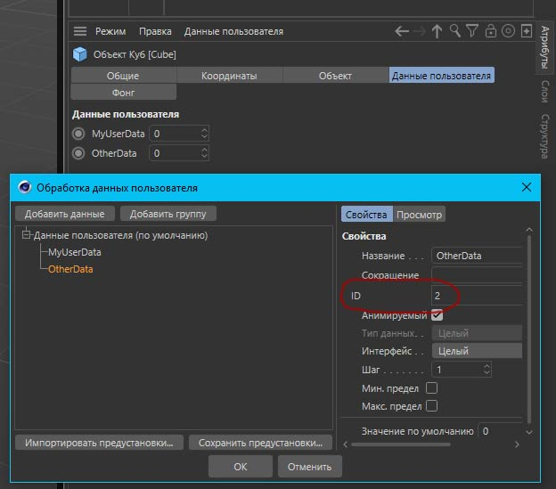

# Python для Cinema 4D
## Как создать тег xpresso

Сначала создаем тег как обычно методом ```MakeTag```:
```python
# получаем активный объект
my_object = doc.GetActiveObject()
# создаем тег expresso
xpresso_tag = my_object.MakeTag(c4d.Texpresso)
# добавляем тег на объект
my_object.InsertTag(xpresso_tag)
```

Для того, чтобы добавить узлы в тег нужно получить корневой узел и в нем XГруппу:
```python
# Получаем мастер узлов и корневой узел
node_master = xpresso_tag.GetNodeMaster() # GvNodeMaster
root = node_master.GetRoot() # XГруппа
```

Создаем узел и привязываем его к активному объекту:
```python
# Создаем узел в Xpresso
node = node_master.CreateNode(root, c4d.ID_OPERATOR_OBJECT, x=20, y=10)
# активный объект будет представлять этот узел
node[c4d.GV_OBJECT_OBJECT_ID] = my_object
```

Теперь, создадим пользовательские данные и поместим на созданный узел входный и выходной порт с сылкой на эти данные:
```python
# Создаем пользовательские данные
bc = c4d.GetCustomDatatypeDefault(c4d.DTYPE_LONG)
bc[c4d.DESC_NAME] = "MyUserData"
element = my_object.AddUserData(bc)

# Создаем пользовательские данные
bc = c4d.GetCustomDatatypeDefault(c4d.DTYPE_LONG)
bc[c4d.DESC_NAME] = "OtherData"
element = my_object.AddUserData(bc)
```
Почти магия :trollface::
```python
# Создаем входной порт для пользовательских данных
USERDATA_NUMBER = 1
node.AddPort(c4d.GV_PORT_INPUT, c4d.DescID(c4d.DescLevel(c4d.ID_USERDATA, c4d.DTYPE_SUBCONTAINER, 0), c4d.DescLevel(USERDATA_NUMBER, c4d.DTYPE_LONG, 0)), message=True)

# Создаем выходной порт для пользовательских данных
USERDATA_NUMBER = 2
node.AddPort(c4d.GV_PORT_OUTPUT, c4d.DescID(c4d.DescLevel(c4d.ID_USERDATA, c4d.DTYPE_SUBCONTAINER, 0), c4d.DescLevel(USERDATA_NUMBER, c4d.DTYPE_LONG, 0)), message=True)
```
Метод AddPort принимает первым параметром константу c4d.GV_PORT_INPUT или c4d.GV_PORT_OUTPUT, а вторым параметром дескриптор описания c4d.DescID (и это как раз тот случай, когда он должен быть написан полностью, с описанием c4d.DescLevel). Переменная
USERDATA_NUMBER в данном примере равна ID пользовательских данных (в менеджере атрибутов)
