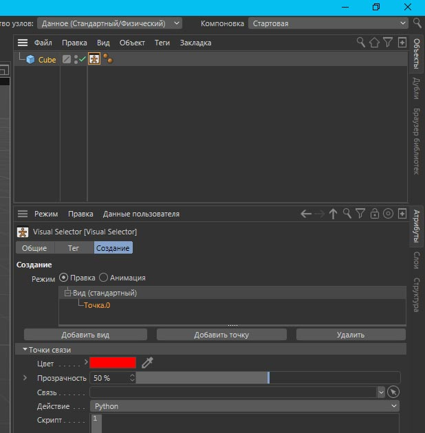

## Использование кода Python в Cinema 4D

1. Как простой скрипт - можем создать иконку и разместить на панели
***

2. Как тег Python - вешаем на объект в сцене - необходима в коде функция main(), которая автоматически вызывается на каждом кадре и при каждом действии на сцене
***

3. Как генератор Python - должен возвращать созданный объект
***

4. Как эффектор Python
***

5. Как плагин Python
***

6. Как узел Python в теге Xpresso
***

7. Как поле Python
***

8. Как тег `взаимодействие`
***

9. Как `Visual Selector` тег (тег > оснастка > Visual Selector)
***

10. В теге `компоненты персонажа` (тег > оснастка > компоненты персонажа)
***

11. В материале `Sketch and Toon` (галочка python в каналах цвет, толщина и прозрачность)
***

Подробности смотреть в документации [Embedded within Cinema 4D][1]

[1]: https://developers.maxon.net/docs/py/23_110/manuals/index.html#embedded-within-cinema-4d "Manual List » Embedded within Cinema 4D"